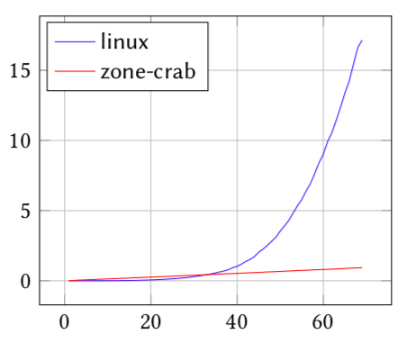

---
# Feel free to add content and custom Front Matter to this file.
# To modify the layout, see https://jekyllrb.com/docs/themes/#overriding-theme-defaults

layout: home
---
The Project
===========

*eBPF* is a machine-language that executes inside the Linux kernel.

*PREVAIL* is a new, abstract-interpetation based verifier, that is simple, scalable, and is capable of handling loops of arbitrary number of iterations.

{: width=200px ; float=left; }
