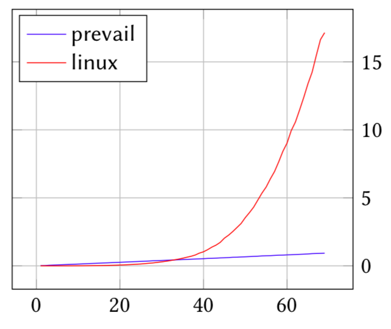

---
# Feel free to add content and custom Front Matter to this file.
# To modify the layout, see https://jekyllrb.com/docs/themes/#overriding-theme-defaults

layout: home
---
*eBPF* is a machine-language that executes inside the Linux kernel.

{: style="width: 380 ; float: right;" }

*PREVAIL* is a new verifier that is **simple**, **scalable**, and capable of handling loops of arbitrary number of iterations. The verifier is based on the theory of abstract-interpetation.

You can find more details in the [PLDI paper](assets/prevail-paper.pdf).
